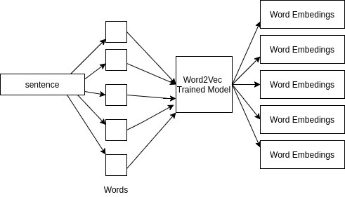
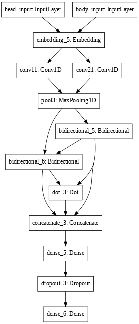

## Installation

Clone the repository
```bash
git clone https://gitlab.com/fake-news1/ibm-fake-news-bot.git
cd ibm-fake-news-bot/ml_API
```

Create Conda Environment
```bash
conda create -n <env_name> python=3.6
conda activate <env_name>
```

Install the dependencies in conda environment:
```python
pip install -r requirements.txt
```

## Usage

To train the model, move to `notebooks` folder and use `Word2Vec.ipynb` file to train it.

To run the deployment server 

```python
python app.py
```

## Approach
- Preprocessing Steps :

    - **[HashTag Segmentation](https://github.com/cbaziotis/ekphrasis)**
    - **[Emoji Substitution](https://github.com/carpedm20/emoji)**
    - **Misc**: We also convert all the text into Lower case. ‘URL’ is substituted by ‘http’, since ‘URL’ does not have embedding representation in some pre-trained embedding and models.
    - **Abbreviation of Words**
    - **Retweets, Dates**
- Used Word2Vec for generating word embeddings. Embeddings are then passed to CNN and BiLSTM network as they are proved to be current state-of-the-art in FakeNewsChallenge Research Paper.
- Optimizer Used : Adam
- Loss Function Used : Categorical Cross Entropy.
- Categorised as :

    - 0 -->> Disagree
    - 1 -->> Agree
    - 2 -->> Discuss
    - 3 -->> Unrelated (As because Google may sometimes give unrelated stuffs to the topic)

- Word2Vec Architecture :


- BiLSTM+CNN Model Architecture :

